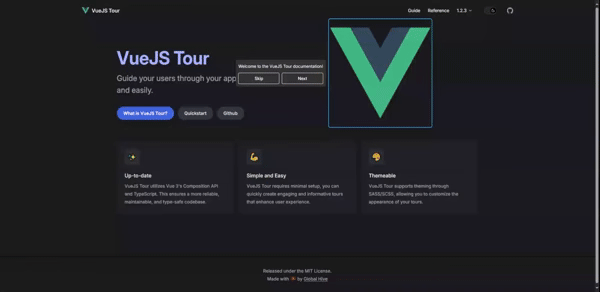

# VueJS Tour

[](https://github.com/GlobalHive/vuejs-tour/blob/master/LICENSE)
[](https://github.com/GlobalHive/vuejs-tour/actions/workflows/docs.yml)
[](https://www.npmjs.com/package/@globalhive/vuejs-tour)
[](https://github.com/GlobalHive/vuejs-tour/issues)<br>
[](https://www.npmjs.com/package/@globalhive/vuejs-tour)
[](https://www.npmjs.com/package/@globalhive/vuejs-tour)

> VueJS Tour is a lightweight, simple and customizable tour plugin.
> It provides a quick and easy way to guide your users through your application.

<a href="https://globalhive.github.io/vuejs-tour/"></a>

## Table of Contents

- [Prerequisites](#prerequisites)
- [Installation](#installation)
- [Create a tour](#create-a-tour)
- [Documentation](#documentation)
- [Something Missing?](#something-missing)

## Prerequisites

* [Node.js](https://nodejs.org/)
* [Vue 3 (Composition API)](https://vuejs.org/guide/introduction.html#composition-api)

## Installation

This section will guide you through the process of installing VueJS Tour.

* Step 1: Go to your project directory and install VueJS Tour using npm:

```bash
cd my-project
npm install @globalhive/vuejs-tour
```

* Step 2: Import the plugin in your application entry point (typically `main.js`):

```javascript
import { createApp } from "vue";
import App from "./App.vue";
import VueJsTour from '@globalhive/vuejs-tour';
import '@globalhive/vuejs-tour/dist/style.css';

const app = createApp(App)
  .use(VueJsTour)
  .mount("#app");
```
Everything is ready! Now you can use VueJS Tour in your application.<br>
Make sure to check out the [documentation](https://globalhive.github.io/vuejs-tour/) for more information.

## Create a tour

Add the VueJS Tour component anywhere in your app. It is recommended to add it to `App.vue`
and create the required steps using `<script setup>` syntax.

```vue
<template>
  <div>
    <div id="selectByID">Selected by its id 'selectByID'</div>
    <p class="selectByClass">Telected by its class 'selectByClass'</p>
    <button data-step="3">Selected by the 'data-step="3"' attribute</button>

    <VTour :steps="steps"/>
  </div>
</template>

<script setup>
const steps = [
  {
    target: '#selectByID',
    content: 'This is the first step',
  },
  {
    target: '.selectByClass',
    content: 'This is the second step, placed on the bottom of the target',
    placement: 'bottom',
  },
  {
    target: '[data-step="3"]',
    content: 'This is the third step',
  }
];
</script>
```


## Start the tour

To start the tour, you can use the `autoStart` prop...

```vue
<template>
  <div>
    <div id="selectByID">Selected by its id 'selectByID'</div>
    <p class="selectByClass">Telected by its class 'selectByClass'</p>
    <button data-step="3">Selected by the 'data-step="3"' attribute</button>

    <VTour :steps="steps" autoStart/>
  </div>
</template>

<script setup>
const steps = [...];
</script>
```

...or call the `startTour()` method on the component instance.

```vue
<template>
  <div>
    <div id="selectByID">Selected by its id 'selectByID'</div>
    <p class="selectByClass">Telected by its class 'selectByClass'</p>
    <button data-step="3">Selected by the 'data-step="3"' attribute</button>

    <VTour ref="tour" :steps="steps"/>
  </div>
</template>

<script setup>
import { ref, onMounted } from 'vue';
const tour = ref(null);

const steps = [...];

onMounted(() => {
  tour.value.startTour();
});
</script>
```

The `target` property of the step object can be any valid [CSS selector](https://developer.mozilla.org/en-US/docs/Web/CSS/CSS_Selectors).

## Documentation

For more information about the available props and methods, check out the [documentation](https://globalhive.github.io/vuejs-tour/).

## Something Missing?

If you have a feature request or found a bug, [let us know](https://github.com/GlobalHive/vuejs-tour/issues) by submitting an issue.
